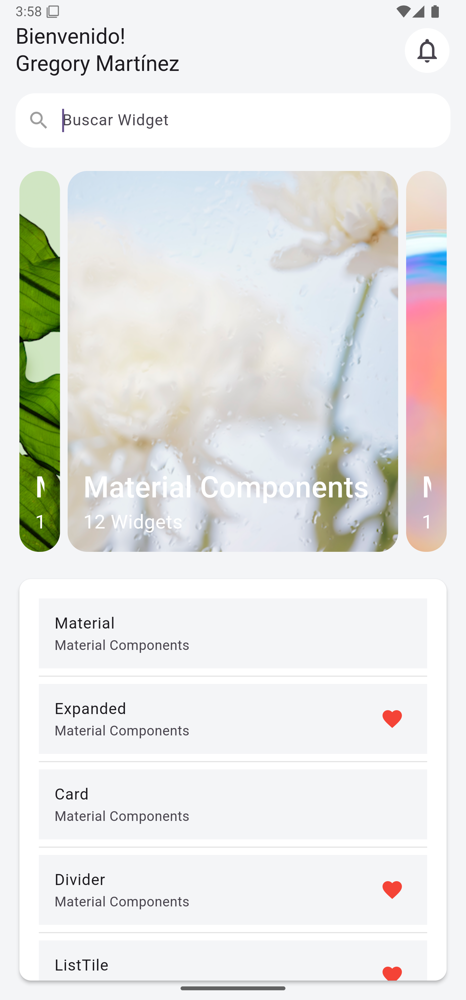

# Capítulo 14: Uso del Widget Divider

## Objetivo

En este capítulo, aprenderás a utilizar el widget **Divider** para separar visualmente los elementos en una lista. Además, se optimizó el código mediante la creación del widget personalizado **_WidgetTile**, que encapsula la lógica y diseño de los elementos de la lista.

---

## Desarrollo

1. **Divider**: Se utilizó para agregar una línea divisoria entre los elementos de la lista, mejorando la organización visual.
2. **_WidgetTile**: Se creó un widget personalizado basado en **ListTile** para reducir la repetición de código y permitir la personalización de cada elemento con propiedades como `title`, `subtitle`, `favorite` y `onTap`.
3. **Optimización del código**: Se reemplazaron los elementos repetitivos de **ListTile** por instancias de **_WidgetTile**, asegurando consistencia y claridad en el diseño.

---

## Conclusión

El widget **Divider** es una herramienta simple pero efectiva para organizar elementos en listas. Combinado con widgets personalizados como **_WidgetTile**, permite crear interfaces limpias, reutilizables y fáciles de mantener. Este enfoque es fundamental para desarrollar aplicaciones escalables y bien estructuradas.

En el próximo capítulo, exploraremos aún más Widgets. ¡Hasta pronto! 🚀

---

