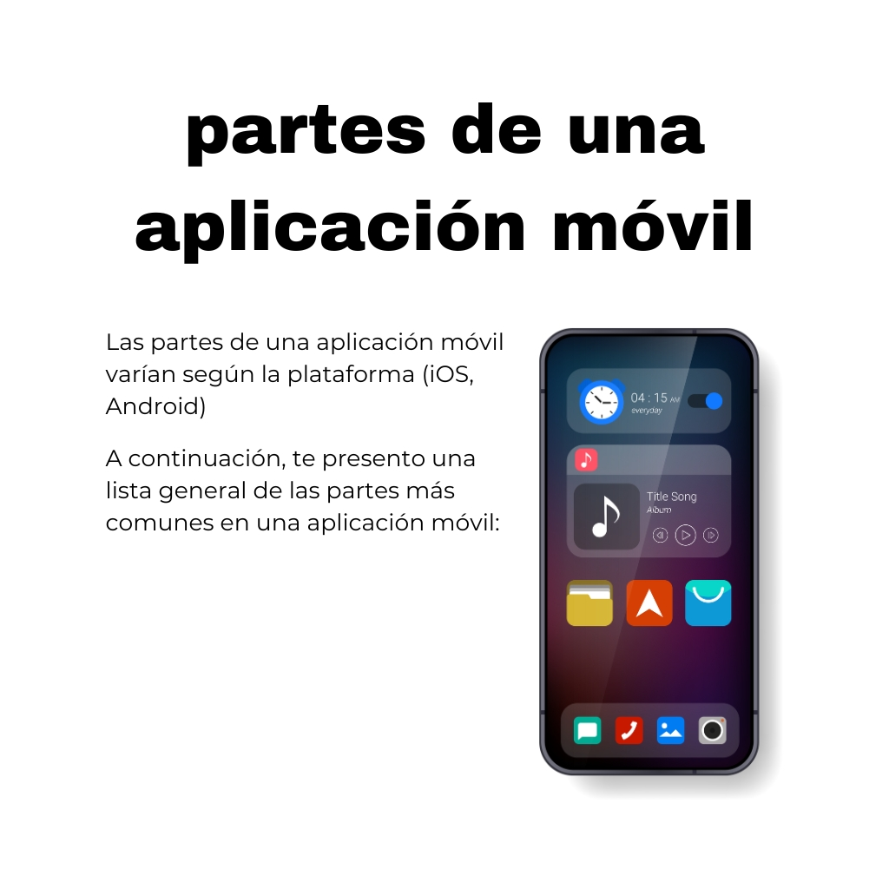
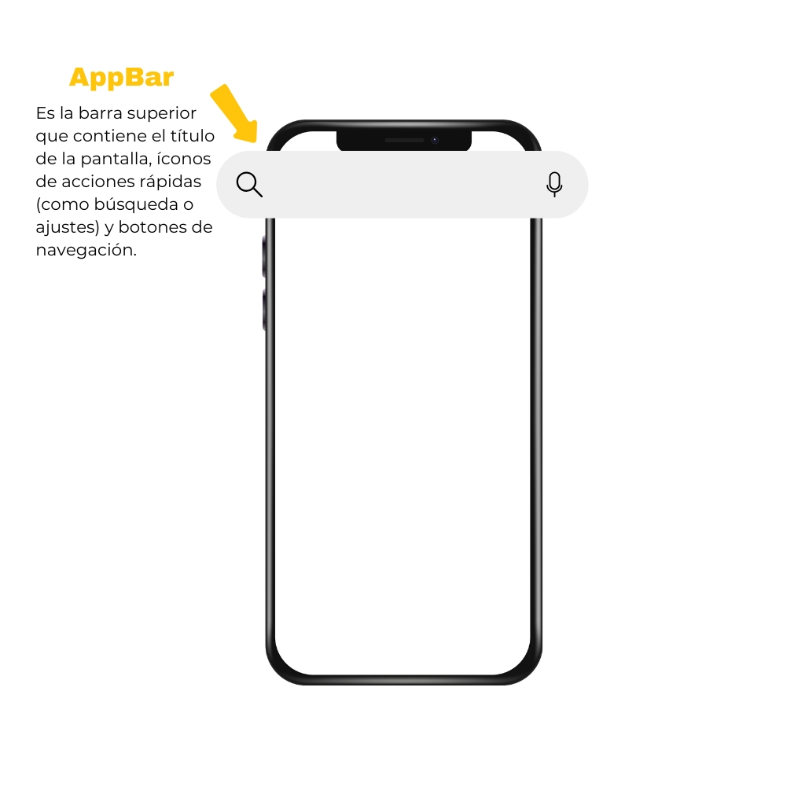
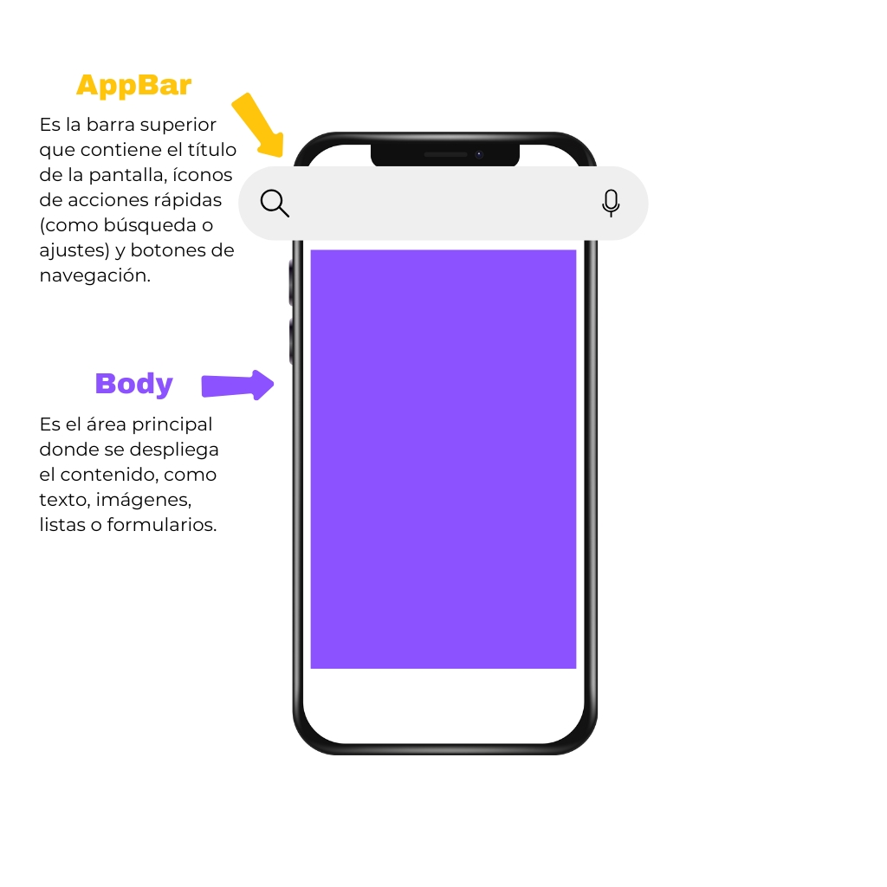
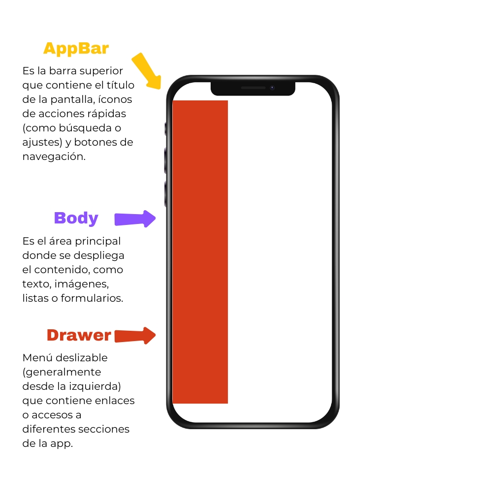
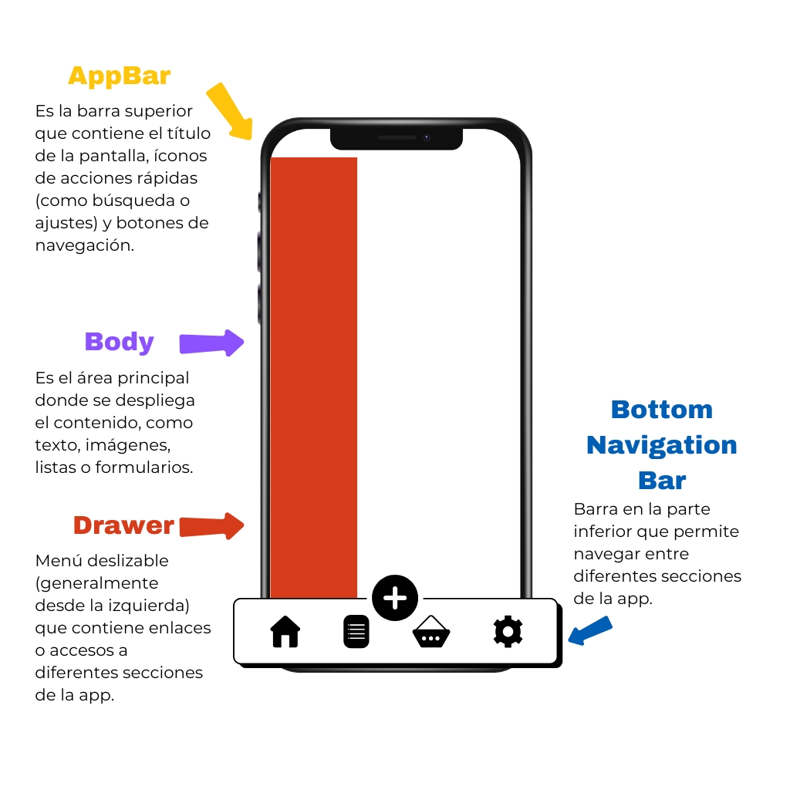
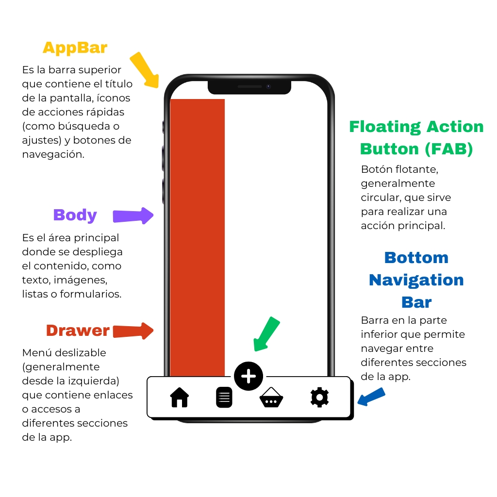

# Capítulo 1: Partes de una Aplicación

## Objetivo

En este capítulo, aprenderás sobre las diferentes partes que componen una aplicación móvil, tanto en términos de diseño como de funcionalidad. Este conocimiento es esencial para comprender la estructura básica de cualquier aplicación desarrollada en Flutter.

---

## Desarrollo

Las partes de una aplicación móvil pueden variar dependiendo de la plataforma (iOS, Android) o del framework utilizado. A continuación, se describen las partes más comunes que conforman una aplicación móvil, acompañadas de ejemplos visuales.

### 1. **AppBar (Barra de Aplicación o de Navegación)**

La **AppBar** es la barra superior que contiene el título de la pantalla, íconos de acciones rápidas (como búsqueda o ajustes) y botones de navegación.

---

### 2. **Body (Cuerpo de la Aplicación)**

El **Body** es el área principal donde se despliega el contenido, como texto, imágenes, listas o formularios. Es la sección central de la pantalla.

---

### 3. **Drawer (Menú Lateral)**

El **Drawer** es un menú deslizable, generalmente accesible desde el lado izquierdo de la pantalla. Contiene enlaces o accesos a diferentes secciones de la aplicación.

---

### 4. **Bottom Navigation Bar (Barra de Navegación Inferior)**

La **Bottom Navigation Bar** es una barra ubicada en la parte inferior de la pantalla. Permite la navegación entre diferentes secciones de la aplicación.

---

### 5. **Floating Action Button (FAB)**

El **Floating Action Button** es un botón flotante, generalmente de forma circular, que sirve para realizar una acción principal dentro de la aplicación.

---

## Conclusión

En este capítulo, hemos explorado las partes fundamentales de una aplicación móvil, destacando la importancia de cada componente en el diseño y la funcionalidad. Comprender estas estructuras es esencial para el desarrollo de aplicaciones intuitivas y atractivas en Flutter.

En los próximos capítulos, profundizaremos en cómo implementar estas partes utilizando Flutter, aprovechando sus widgets y herramientas para crear aplicaciones modernas y eficientes.
