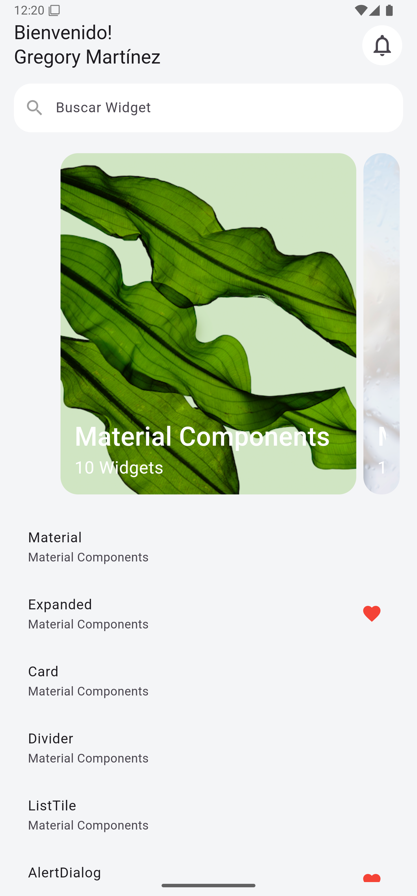

# Capítulo 12: Uso del Widget Expanded

## Objetivo

En este capítulo, aprenderás a usar el widget **Expanded** para ajustar dinámicamente el tamaño de un widget secundario dentro de un contenedor flexible. En este caso, **ListView** se envolvió con **Expanded** para permitir que ocupe el espacio disponible dentro de un diseño de tipo columna o fila.

---

## Desarrollo

1. Se utilizó **Expanded** para envolver un **ListView**, permitiendo que este último ajuste su tamaño automáticamente al espacio disponible.
2. **Expanded** es útil en diseños flexibles con widgets como **Column** o **Row**, asegurando que los elementos secundarios no excedan los límites del contenedor padre.
3. Este enfoque elimina la necesidad de definir un tamaño fijo, como se hizo en capítulos anteriores, ofreciendo un diseño más adaptable.

---

## Conclusión

El widget **Expanded** es una herramienta esencial para construir diseños responsivos y flexibles en Flutter. Este capítulo demuestra cómo aprovechar **Expanded** para manejar espacios dinámicos en la interfaz, mejorando la adaptabilidad de las aplicaciones.

En el siguiente capítulo, exploraremos el uso combinado de más widgets para crear interfaces avanzadas y prácticas. ¡Sigue aprendiendo y practicando! 🚀

---

