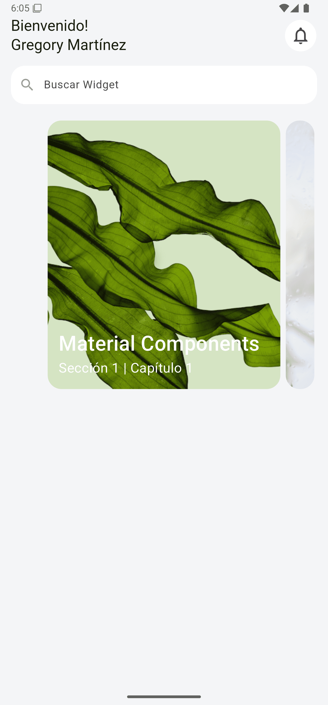

# Capítulo 8: Widget OverflowBox

## Objetivo

En este capítulo, aprenderás a usar el widget **OverflowBox** para ajustar elementos que exceden las dimensiones asignadas por sus padres. Esto es útil para manejar contenido dinámico que necesita más espacio del disponible en su contenedor inmediato.

---

## Desarrollo

1. Se reemplazó el **Container** utilizado en el capítulo anterior por un widget **OverflowBox**.
2. La propiedad `maxWidth` del **OverflowBox** se configuró en `500` para limitar la expansión horizontal del contenido.
3. Se incluyó una imagen dinámica cargada mediante `Image.network` como elemento hijo del **OverflowBox**.
4. La propiedad `fit` de la imagen se mantuvo como `BoxFit.cover` para asegurar que ocupe todo el espacio asignado, adaptándose a las dimensiones del **OverflowBox**.

---

## Conclusión

El widget **OverflowBox** es ideal para manejar casos donde los elementos necesitan exceder las dimensiones de su contenedor padre. En este capítulo, aprendimos a usarlo para mostrar imágenes de mayor tamaño sin alterar la estructura del diseño. Esta técnica es especialmente útil para diseños responsivos y personalizados.

En el siguiente capítulo, exploraremos cómo combinar varios widgets avanzados para lograr interfaces más ricas y dinámicas. ¡Continúa aprendiendo y experimentando! 🚀

