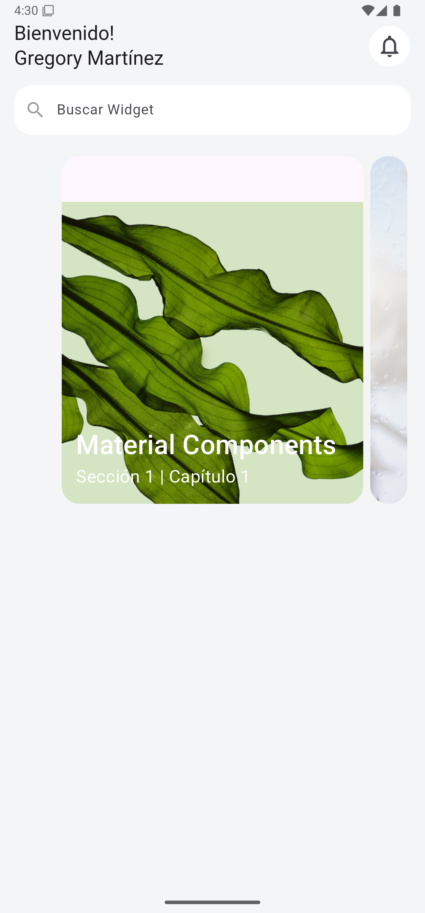

# Capítulo 7: Widget Stack

## Objetivo

En este capítulo, aprenderás a implementar el widget **Stack** para crear interfaces dinámicas y superpuestas. Este widget es útil para mostrar contenido en capas, como imágenes con texto superpuesto o elementos interactivos en diferentes niveles visuales.

---

## Desarrollo

1. Se utilizó el widget **Stack** para organizar elementos de forma superpuesta.
2. La propiedad `alignment` se configuró en `AlignmentDirectional.bottomStart` para posicionar los elementos secundarios en la parte inferior izquierda de la pila.
3. Se agregó un **Container** con una imagen como fondo, utilizando `Image.network` y configurando su ajuste mediante `BoxFit.cover`.
4. Se incluyó un texto descriptivo dentro de un **Column**, con formato personalizado para resaltar el diseño visual.
5. Se añadió un **Padding** al texto para separarlo del borde de la imagen, mejorando su legibilidad y estética.

---

## Conclusión

El widget **Stack** permite crear diseños complejos con múltiples capas superpuestas. En este capítulo, aprendimos a superponer texto sobre imágenes y a personalizar el diseño visual con alineaciones y propiedades de estilo. Este enfoque es ideal para interfaces modernas e interactivas.

En los siguientes capítulos, seguiremos explorando widgets avanzados y cómo usarlos para enriquecer tus aplicaciones. ¡Continúa aprendiendo y creando! 🚀

## Muestra

