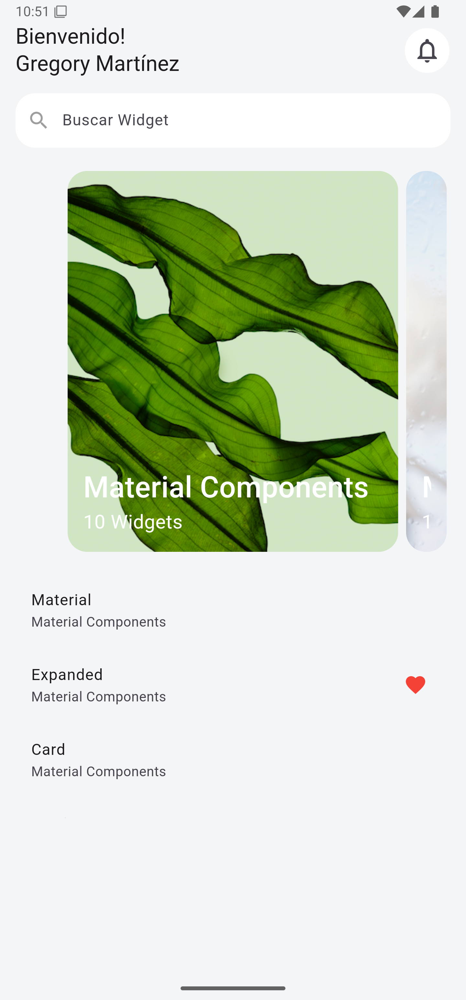

# Capítulo 11: ListView y ListTile

## Objetivo

En este capítulo, aprenderás a utilizar los widgets **ListView** y **ListTile** para crear listas simples y funcionales. Además, exploraremos cómo definir un tamaño fijo para una lista y cómo interactuar con los elementos a través de eventos como `onTap`.

---

## Desarrollo

1. **ListView**: Se utilizó para mostrar una lista de elementos desplazables en un espacio limitado.
2. **ListTile**: Se implementó para representar cada elemento de la lista, aprovechando su diseño predeterminado que incluye `title`, `subtitle`, `leading`, `trailing` y eventos como `onTap`.
3. Se añadió un nuevo elemento a la lista de categorías: "Diálogos", ampliando el contenido mostrado en capítulos anteriores.
4. El código incluye el uso de `SizedBox` para controlar el espaciado entre los elementos y definir el tamaño de la lista.

---

## Conclusión

El uso de widgets como **ListView** y **ListTile** es fundamental para mostrar listas de contenido de manera eficiente y personalizable en aplicaciones Flutter. Este capítulo demuestra cómo estructurar una lista con propiedades simples y añadir interactividad con `onTap`.

En el siguiente capítulo, exploraremos aún más widgets. ¡Sigue aprendiendo y construyendo! 🚀

---

